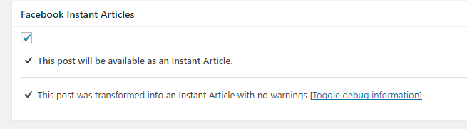

# FB_Instant_Articles_wp
Added some functionality to <a href="https://wordpress.org/plugins/fb-instant-articles/">FaceBook Instant Pages</a> plugin for wordpress

Fixed the plugin. Now there's a checkbox which filters unwanted posts from RSS Feed.
I know it's a bit ugly solution: I added a new table with ID of posts which will be displayed in the feed.
Just install updated the plugin. 
Thanks
